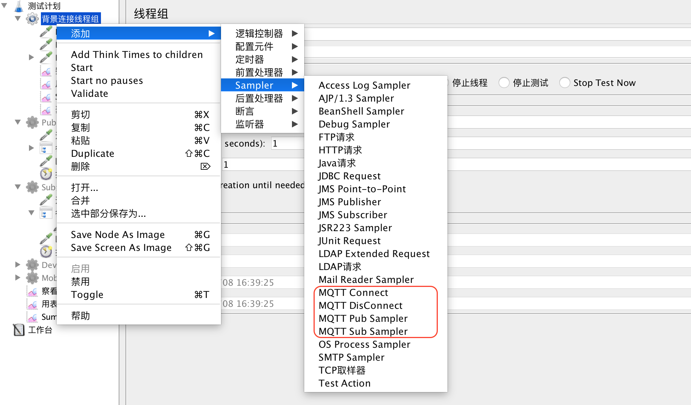
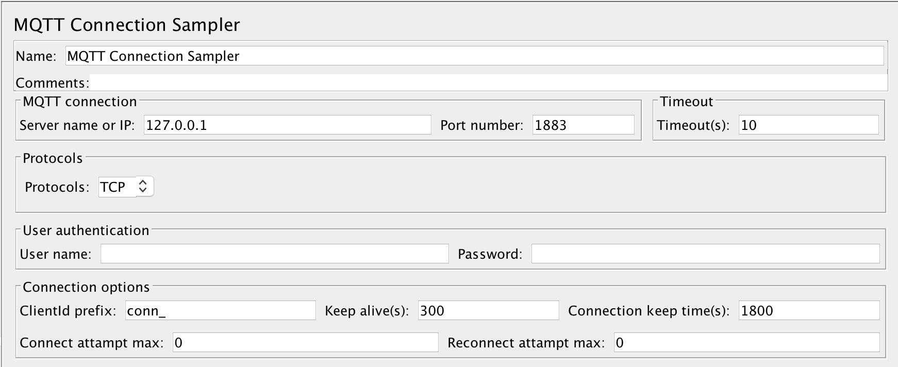
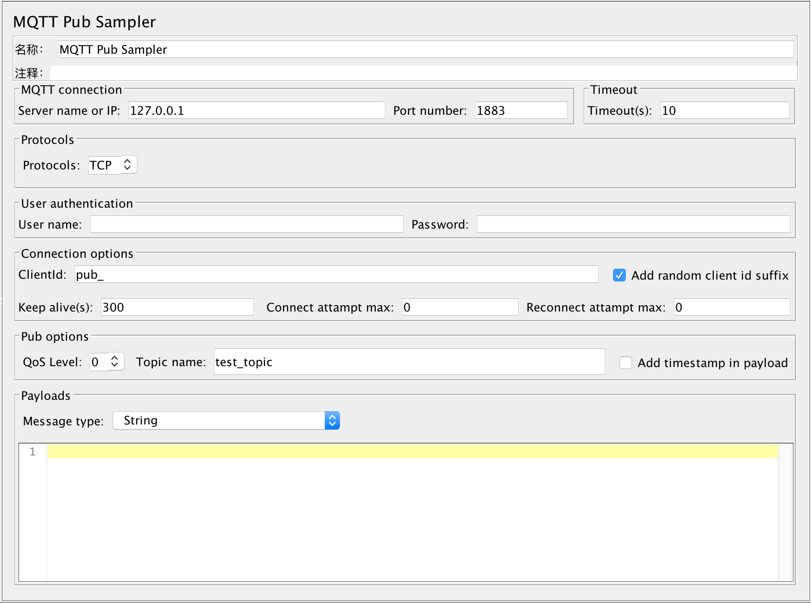
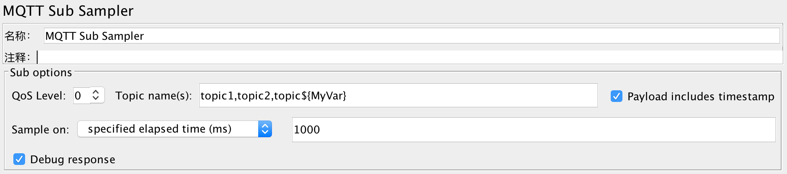
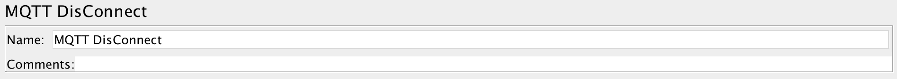
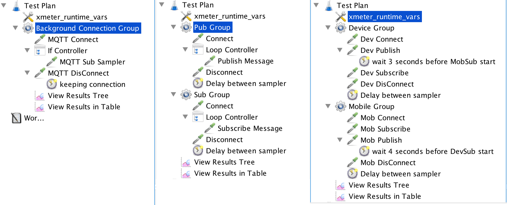

# mqtt-jmeter Overview
MQTT JMeter Plugin extends your JMeter's capability to test against MQTT protocol, just as easy as ordinary HTTP protocal. 

It has been used to benchmark EMQ server performance, and here is the [report link](https://github.com/emqx/emq-xmeter-cn).

This plugin is developed and maintained by [XMeter](https://www.xmeter.net). XMeter is a professional performance testing service provider.

# Install instruction
The plugin is a standard JMeter plugin. You can download the latest version of mqtt-jmeter from [here](https://github.com/emqx/mqtt-jmeter/releases), and then copy the downloaded JAR files into $JMETER_HOME/lib/ext folder. After restarting the JMeter, you can see "MQTT samplers" provided by this plugin.

To use this plugin, we recommend you to install JMeter 3.2 or above.

## Build from source code

If you'd like to build binary by yourself, please clone the project and run 'mvn install'. Maven will download some JMeter dependency binary files, so the build elapsed time will up to your network status.

# How to use
The plugin includes 4 samplers: 

- Connect sampler: Initiate MQTT server connection on behalf of a device. In addition to normal connection setup, this sampler can be used to simulate massive "background" connections(no data transimission but regular hearbeat signals) to the designated MQTT server or cluster system. 

- Pub sampler: publish various messages to the target MQTT server.

- Sub sampler: subscribe message(s) from target MQTT server.

- DisConnect sampler: Reset the connection to target MQTT server.

If MQTT JMeter plugin is successfully installed, you can find these MQTT samplers under JMeter 'Sampler' context menu.




## Connect Sampler


### MQTT connection

This section includes basic connection settings.

- **Server name or IP**: The MQTT target to be tested. It can be either IP address or server name. The default value is 127.0.0.1. **DO NOT** add protocol (e.g. tcp:// or ssl://) before server name or IP address! 

- **Port number**: The port opened by MQTT server. Typically 1883 is for TCP protocol, and 8883 for SSL protocol.

- **MQTT version**: The MQTT version, default is 3.1, and another option is 3.1.1. Sometimes we found version 3.1.1 is required to  establish connection to [Azure IoTHub](https://github.com/emqx/mqtt-jmeter/issues/21).

- **Timeout(s)**: The connection timeout seconds while connecting to MQTT server. The default is 10 seconds.


### MQTT Protocol

The sampler supports 4 protocols, TCP, SSL, WS, WSS.
For SSL and WSS protocols, it includes normal SSL and dual SSL authentication. 

If **'Dual SSL authentication'** is checked, please follow 'Certification files for SSL/TLS connections' at end of this doc to set the client SSL configuration properly.


### User authentication

User can configure MQTT server with user name & password authentication, refer to [EMQ user name and password authentication guide](http://emqtt.com/docs/v2/guide.html#id3).

- **User name**: If MQTT server is configured with user name, then specify user name here.

- **Password**: If MQTT server is configured with password, then specify password here.

### Connection options

- **ClientId**: Identification of the client, i.e. virtual user or JMeter thread. Default value is 'conn_'. If 'Add random client id suffix' is selected, JMeter plugin will append generated uuid as suffix to represent the client, otherwise, the text of 'ClientId' will be passed as 'clientId' of current connection.
- **Keep alive(s)**: Ping packet send interval in seconds. Default value is 300, which means each connection sends a ping packet to MQTT server every 5 minutes.
- **Connect attampt max**: The maximum number of reconnect attempts before an error is reported back to the client on the first attempt by the client to connect to a server. Set to -1 to use unlimited attempts. Defaults to 0.
- **Reconnect attampt max**:  The maximum number of reconnect attempts before an error is reported back to the client after a server connection had previously been established. Set to -1 to use unlimited attempts. Defaults to 0.
- **Clean session**: If you want to maintain state information between sessions, set it to false; otherwise, set it to true.


## Pub Sampler


Pub sampler reuses previously established connection (by Connect sampler) to publish a message. If connection is not ready at this moment, pub sampler will just fail immediately.

### Pub options

- **QoS level**: The available QoS value, 0 is AT_MOST_ONCE, 1 is AT_LEAST_ONCE and 2 is EXACTLY_ONCE.
- **Retained messages**: Set it to true if the Pub sampler wants the broker to keep the last message on the given topic, so that the client subscribed to that topic receives the retained message immediately after subscription.
- **Topic name**: Name of the topic that the message will be sent to.
- **Add timestamp in payload**: Add timestamp in the payload or not. If the checkbox is enabled, then timestamp of running pub sampler will be added before real payload. Mostly it's used together with **Sub sampler** to calculate message latency time.

### Payloads

**Message type**: 3 types of message can be used. 

- String: The normal string that sent to MQTT server. It can also be a JMeter variable.

- Hex string: The hex string that sent to MQTT server. The chars input must be [0-9] or [A-F] or [a-f]. The hex string will be converted to binary and send to server. It can also be a JMeter variable.

- Random string with fixed length: Refer to below screenshot. If the option is selected, then it requires user to input 'Length'. The length means the auto generated string length. Default is 1024, which means generated a 1kb size of random string.


## Sub Sampler


Sub sampler reuses previously established connection (by Connect sampler) to subscribe message(s). If connection is not ready at this moment, sub sampler will just fail immediately.

### Sub options

-  **QoS level**: The available QoS value, 0 is AT_MOST_ONCE, 1 is AT_LEAST_ONCE and 2 is EXACTLY_ONCE.

-  **Topic name(s)**: A list of topic names (comma-separated) that will be subscribed to.

-  **Payload includes timestamp**: If the checkbox is enabled, then it means the payload includes timestamp. It can be used to calcuate the message latency time.

```
message_latency = timestamp_in_sub_when_receive_msg - timestamp_in_payload (timestamp in pub machine when sending out message)

Please notice, if the machine publish message is not the same as subscriber, then the calculated message latency time is not accurate. 
It's because the time is almost not the same in different machines. So the latency time calculated by sub sampler could be only be a reference.
```
- **Sample on**: It controls how to sample. The default value is '**elapsed with specified time(ms)**', which means a sub sampler will  occur every specified milli-seconds (default is 1000ms). During the 1000 ms, multiple messages could be received, and result in report is the summarized data during 1000 ms. If the value is set to 2000, then means summarized report during 2000 ms. Another option is '**number of received messages**', which means a sub sampler will occur after receiving these specified number of messages (default is 1). 

- **Debug response**: If checked, the received message will be print in response. It's recommended to enable this option when you debug your script.


## DisConnect Sampler


This sampler is very simple, it just clear the previous created connection. Therefore, next time you run Connect sampler, it will initiate a new MQTT server connection for you. As you can imagine, Disconnect sample will fail immediately if no connection is detected at this moment.


## Example JMeter Scripts
As a reference, you can check out some example scripts in SampleScripts folder.
1) background_connection.jmx:
Simulate massive background MQTT connections to server. You can optionally subscribe to a topic when connecting. (Please modify "xmeter_runtime_vars" UDV to fit your needs.)

2) pubsub_unidirection.jmx:
Demonstrate how sub sampler can get messages from corresponding pub sampler, with two JMeter user groups and delay between opertions.

3) pubsub_bidirection.jmx:
Demonstrate how a set of Devices and Mobiles exchange messages in both directions. 



## Certification files for SSL/TLS connections
After deploying emqtt server, you get the following OOTB (out of the box) SSL/TLS certification files under ${EMQTTD_HOME}/etc/certs directory:

1) **cacert.pem** : the self-signed CA certification 

2) **cert.pem** : certification for emqtt server

3) **client-cert.pem** : certfication for emqtt client in order to connect to server via SSL/TLS connection. In this jmeter plugin case, the client implies jmeter "virtual user" 

4) **client-key.pem** **key.pem** : key files to protect client and server certification respectively

[Note:] The above server and client certifications are both issued by the self-signed CA. If you would like to use official certifications for your EMQTT deployment, please check out relevant document to configure it.

We will use the OOTB test certfications (as an example) to show you how to prepare the required certification files for this EMQTT JMeter plugin.

```
export PATH=$PATH:<YOUR_JDK_HOME>/bin

keytool -import -alias cacert -keystore emqtt.jks -file cacert.pem -storepass <YOUR_PASSWORD> -trustcacerts -noprompt
keytool -import -alias client -keystore emqtt.jks -file client-cert.pem -storepass <YOUR_PASSWORD>
keytool -import -alias server -keystore emqtt.jks -file cert.pem -storepass <YOUR_PASSWORD>

openssl pkcs12 -export -inkey client-key.pem -in client-cert.pem -out client.p12 -password pass:<YOUR_PASSWORD>
```

#### Specify key store, client certfication and corresponding pass phrases in plugin sampler:


